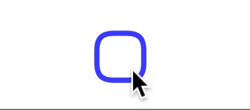

# Smoothly Animated ToDo App built with React Native


Try the demo on [](https://expo.dev/@craftzdog/animated-todo)

The animated checkbox component has been published as [an NPM module `react-native-checkbox-reanimated`](https://github.com/craftzdog/react-native-checkbox-reanimated).



## Tutorial

Watch how I built this website on YouTube: [](https://youtu.be/k2h7usLLBhY)

## Stack

- [React Native](https://reactnative.dev/) - ReactJS-based framework that can use native platform capabilities
- [Expo](https://expo.dev/) - Toolset for building and delivering RN apps
- [React Navigation(v6)](https://reactnavigation.org/) - Routing and navigation
- [NativeBase(v3)](https://nativebase.io/) - Themable component library
- [React Native Reanimated](https://docs.swmansion.com/react-native-reanimated/) - Animations
- [React Native SVG](https://github.com/react-native-svg/react-native-svg) - Drawing SVG
- [Moti](https://moti.fyi/) - Helper module for Reanimated 2

## Project structure

```
$PROJECT_ROOT
├── App.tsx        # Entry point
└── src
    ├── screens    # Screen components
    ├── components # UI components
    ├── utils      # Custom hooks and helpers
    └── assets     # Image files
```

## Credits

- [SALY 3D Illustration Pack](https://www.figma.com/community/file/890095002328610853)
- [Animated SVG stroke example by William Candillon](https://github.com/wcandillon/can-it-be-done-in-react-native/tree/master/reanimated-2/src/StrokeAnimation)

## How to dev

This project can be run from the Expo client app.

```sh
yarn
yarn start
```

---

Looking for a Markdown note-taking app? Check out my app called Inkdrop:

[](https://www.inkdrop.app/)
